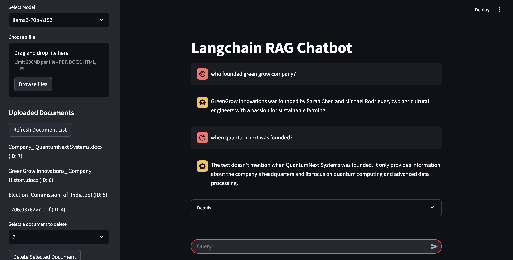

# Retrieval Augmented Generation (RAG) System

This project implements a Retrieval Augmented Generation (RAG) system using LangChain, FastAPI, and Streamlit. It provides a chatbot interface that can answer questions based on a provided set of documents, maintaining conversation history for context.

## Features

*   **RAG Pipeline:** Integrates LangChain for orchestrating the RAG pipeline, including document retrieval, prompt engineering, and language model interaction.
*   **Document Management:**  Provides endpoints for uploading, managing, and indexing documents.
*   **Chat History:** Maintains conversation history to provide context for subsequent interactions.
*   **Scalable API:** Built with FastAPI for a robust and scalable backend.
*   **User-Friendly Interface:** Deployed with Streamlit for an intuitive user experience.
*   **Vector Database:** Utilizes Chroma for efficient document embedding and retrieval.
*   **Database Persistence:** Employs SQLite for storing chat logs and document metadata.
*   **Type Safety:** Uses Pydantic models for request and response validation.

